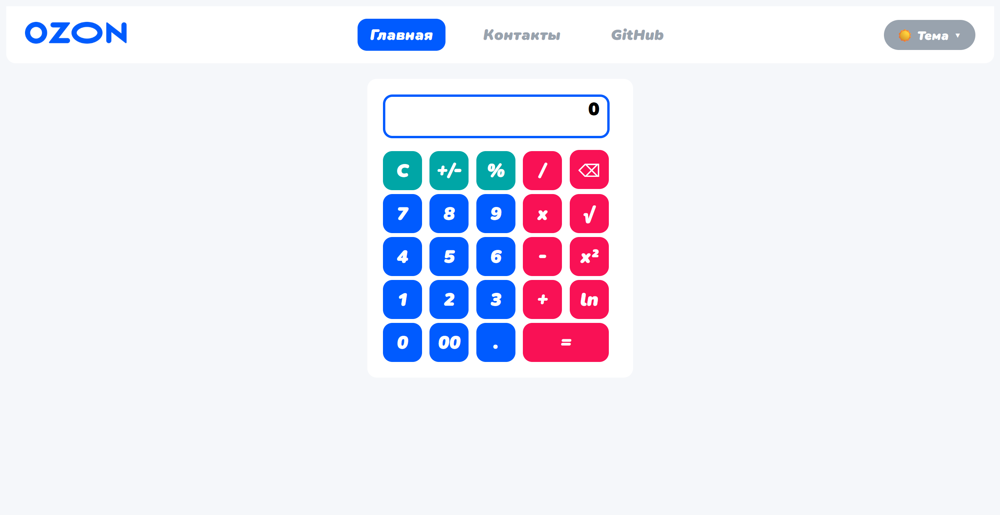
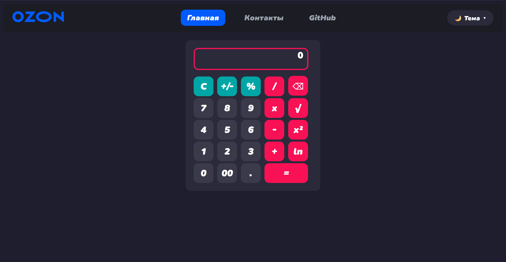
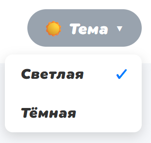

# ЛР 2. Calculator. JavaScript

**Цель** данной лабораторной работы - знакомство с инструментами построения пользовательских интерфейсов web-сайтов: HTML, CSS, JavaScript. В ходе выполнения работы, вам предстоит продолжить реализовывать простой калькулятор, и затем выполнить задания по варианту.

***Тема:*** Заявки от коллцентра мелкого бизнеса.



## Программрование кнопок калькулятора

Основная логика калькулятора реализована через обработку событий клика на кнопки. Все переменные состояния (первое число, второе число, выбранная операция) хранятся в глобальной области видимости. После загрузки страницы инициализируются обработчики событий для всех кнопок калькулятора и переключателя темы.

### Программирование кнопок с цифрами

Кнопки с цифрами (0-9, 00, ".") обрабатываются через общий обработчик событий. При нажатии на цифру она добавляется к текущему числу (a или b в зависимости от того, выбрана ли операция). Точка добавляется только один раз для каждого числа. Результат отображается в окне вывода с форматированием.

```js
const digitButtons = document.querySelectorAll('[id ^= "btn_digit_"]')

function onDigitButtonClicked(digit) {
    if (!selectedOperation) {
        if ((digit != '.') || (digit == '.' && !a.includes(digit))) {
           a += digit;
        }
        outputElement.innerHTML = a === '' ? 0 : formatResult(a);
    }
    else {
        if ((digit != '.') || (digit == '.' && !b.includes(digit))) {
            b += digit;
            outputElement.innerHTML = b === '' ? 0 : formatResult(b);
        }
    }
}

digitButtons.forEach(button => {
    button.onclick = function() {
        const digitValue = button.innerHTML;
        onDigitButtonClicked(digitValue);
    }
});
```

### Программирование кнопок простых операций (+, -, *, /)

Кнопки арифметических операций сохраняют выбранную операцию в переменную selectedOperation. Перед сохранением проверяется, что первое число введено. После выбора операции ввод цифр начинает заполнять второе число (b).

```js
document.getElementById("btn_op_mult").onclick = function() {
    if (a === '') return;
    selectedOperation = 'x';
}

document.getElementById("btn_op_plus").onclick = function() {
    if (a === '') return;
    selectedOperation = '+';
}

document.getElementById("btn_op_minus").onclick = function() {
    if (a === '') return;
    selectedOperation = '-';
}

document.getElementById("btn_op_div").onclick = function() {
    if (a === '') return;
    selectedOperation = '/';
}
```

### Программирование кнопки операции "="

Кнопка равно выполняет вычисление результата на основе первого числа, второго числа и выбранной операции. Результат вычисления сохраняется в переменную a для возможности продолжения вычислений. Используется оператор switch для выбора нужной арифметической операции.

```js
document.getElementById("btn_op_equal").onclick = function() {
    if (a === '' || b === '' || !selectedOperation)
        return

    switch(selectedOperation) {
        case 'x':
            expressionResult = (+a) * (+b)
            break;
        case '+':
            expressionResult = (+a) + (+b)
            break;
        case '-':
            expressionResult = (+a) - (+b)
            break;
        case '/':
            expressionResult = (+a) / (+b)
            break;
        default:
            break;
    }

    a = formatResult(expressionResult);
    b = ''
    selectedOperation = null

    outputElement.innerHTML = a
}
```

### Программирование кнопки "С" (очистка)

Кнопка очистки сбрасывает все переменные состояния калькулятора в исходные значения и отображает ноль в окне результата.

```js
document.getElementById("btn_op_clear").onclick = function() {
    a = ''
    b = ''
    selectedOperation = ''
    expressionResult = ''
    outputElement.innerHTML = 0
}
```

### Программирование кнопки "+/-" (смена знака)

Кнопка меняет знак текущего числа на противоположный (умножает на -1). Работает как для первого, так и для второго числа в зависимости от состояния калькулятора.

```js
Кнопка меняет знак текущего числа на противоположный (умножает на -1). Работает как для первого, так и для второго числа в зависимости от состояния калькулятора.
```

### Программирование кнопки "%" (проценты)

Кнопка процентов вычисляет процент от числа. Если операция не выбрана - делит текущее число на 100. Если операция выбрана - вычисляет процент от первого числа относительно второго.

```js
document.getElementById("btn_op_percent").onclick = function() {
    if (!selectedOperation) {
        if (a === '' || a === '-') return;
        a = formatResult(parseFloat(a) / 100);
        outputElement.innerHTML = a;
    } else {
        if (b === '' || b === '-') return;
        let aNum = parseFloat(a);
        let bNum = parseFloat(b);
        let percentValue = aNum * bNum / 100;
        b = formatResult(percentValue);
        outputElement.innerHTML = b;
    }
}
```

### Программирование кнопки "⌫" (удаление последнего символа)

Кнопка удаляет последний введённый символ из текущего числа. Если после удаления число становится пустым - отображается ноль.

```js
document.getElementById("btn_op_del").onclick = function() {
    if (!selectedOperation) {
        if (a === '' || a === '-') {
            a = '';
            outputElement.innerHTML = 0;
            return;
        }
        a = a.slice(0, -1);
        if (a === '' || a === '-') {
            outputElement.innerHTML = 0;
        } else {
            outputElement.innerHTML = a;
        }
    } else {
        if (b === '' || b === '-') {
            b = '';
            outputElement.innerHTML = 0;
            return;
        }
        b = b.slice(0, -1);
        if (b === '' || b === '-') {
            outputElement.innerHTML = 0;
        } else {
            outputElement.innerHTML = b;
        }
    }
};
```

### Программирование кнопки "√" (квадратный корень)

Кнопка вычисляет квадратный корень из текущего числа. При попытке извлечь корень из отрицательного числа отображается ошибка.

```js
document.getElementById("btn_op_sqrt").onclick = function() {
    if (!selectedOperation) {
        if (a === '' || a === '-') return;
        let num = parseFloat(a);
        if (num < 0) {
            outputElement.innerHTML = 'Error';
            return;
        }
        a = formatResult(Math.sqrt(num));
        outputElement.innerHTML = a;
    } else {
        if (b === '' || b === '-') return;
        let num = parseFloat(b);
        if (num < 0) {
            outputElement.innerHTML = 'Error';
            return;
        }
        b = formatResult(Math.sqrt(num));
        outputElement.innerHTML = b;
    }
};
```

### Программирование кнопки "x²" (возведение в квадрат)

Кнопка возводит текущее число в квадрат (умножает число само на себя).

```js
document.getElementById("btn_op_pow2").onclick = function() {
    if (!selectedOperation) {
        if (a === '' || a === '-') return;
        let num = parseFloat(a);
        a = formatResult(num * num);
        outputElement.innerHTML = a;
    } else {
        if (b === '' || b === '-') return;
        let num = parseFloat(b);
        b = formatResult(num * num);
        outputElement.innerHTML = b;
    }
};
```

### Программирование кнопки "ln" (натуральный логарифм)

Кнопка вычисляет натуральный логарифм от текущего числа. При попытке вычислить логарифм от нуля или отрицательного числа отображается ошибка.

```js
document.getElementById("btn_op_ln").onclick = function() {
    if (!selectedOperation) {
        if (a === '' || a === '-') return;
        let num = parseFloat(a);
        if (num <= 0) {
            outputElement.innerHTML = 'Error';
            return;
        }
        a = formatResult(Math.log(num));
        outputElement.innerHTML = a;
    } else {
        if (b === '' || b === '-') return;
        let num = parseFloat(b);
        if (num <= 0) {
            outputElement.innerHTML = 'Error';
            return;
        }
        b = formatResult(Math.log(num));
        outputElement.innerHTML = b;
    }
};
```

## Программирование окна с результатом

Функция formatResult отвечает за форматирование выводимого значения. Она обрабатывает ошибки, пустые значения и большие числа. Для корректного отображения чисел реализована функция `formatResult()`, которая автоматически переключает формат представления при превышении порога 10¹⁰. Большие и очень маленькие числа отображаются в научной нотации с точностью до 10 значащих цифр. Это обеспечивает читаемость результата и предотвращает выход чисел за пределы окна вывода.

```js
function formatResult(value) {
    if (value === 'Error' || value === '' || value === '-') return value;
    let num = parseFloat(value);
    if (isNaN(num)) return value;
    if (value <= 10**10) return num;
    return num.toPrecision(10);
}
```

## Программирование кнопки переключения темы

Переключатель тем реализован через выпадающий список с двумя опциями (Светлая/Тёмная). Выбор темы сохраняется в localStorage для сохранения предпочтений пользователя между сеансами. При переключении темы к body добавляется или удаляется класс dark-theme, который активирует соответствующие CSS-стили.






```js
const themeButton = document.getElementById('themeButton');
const themeDropdown = document.getElementById('themeDropdown');
const themeOptions = document.querySelectorAll('.theme-option');

function setTheme(theme) {
    if (theme === 'dark') {
        document.body.classList.add('dark-theme');
    } else {
        document.body.classList.remove('dark-theme');
    }
    localStorage.setItem('theme', theme);
    themeOptions.forEach(opt => {
        opt.classList.remove('selected');
        if (opt.dataset.theme === theme) {
            opt.classList.add('selected');
        }
    });
    themeButton.innerHTML = theme === 'dark' ? '🌙 Тема ▾' : '☀️ Тема ▾';
}

const savedTheme = localStorage.getItem('theme') || 'light';
setTheme(savedTheme);

themeButton.addEventListener('click', (e) => {
    e.stopPropagation();
    themeDropdown.classList.toggle('show');
});

themeOptions.forEach(option => {
    option.addEventListener('click', (e) => {
        e.stopPropagation();
        setTheme(option.dataset.theme);
        themeDropdown.classList.remove('show');
    });
});

document.addEventListener('click', (e) => {
    if (!themeButton.contains(e.target) && !themeDropdown.contains(e.target)) {
        themeDropdown.classList.remove('show');
    }
});
```

```css
body.dark-theme {
    background-color: #1e1e2f;
    color: #f0f0f0;
}

body.dark-theme .calculator {
    background-color: #2a2a3a;
}

body.dark-theme .result {
    background-color: #2a2a3a;
    color: #fff;
    border-color: #f91155;
}

body.dark-theme .my-btn {
    background-color: #3a3a4a;
    color: #fff;
}

body.dark-theme header {
    background-color: #1c1c25;
}
```

## Выполненное дополнительное задание:

1. **Операция смены знака +/-** - реализована через обработчик `btn_op_sign`, умножает текущее число на -1
2. **Операция вычисления процента %** - реализована через обработчик `btn_op_percent`, вычисляет процент от числа
3. **Кнопка стирания ⌫** - реализована через обработчик `btn_op_del`, удаляет последний введённый символ
4. **Смена темы (светлая/тёмная)** - реализован переключатель тем с сохранением выбора в `localStorage`
5. **Квадратный корень √** - реализована через `Math.sqrt()` с проверкой на отрицательные числа
6. **Возведение в квадрат x²** - реализована через умножение числа само на себя
7. **Индивидуальная операция (натуральный логарифм ln)** - реализована через `Math.log()` с проверкой на неположительные числа
8. **Кнопка "00" (два нуля)** - реализована как отдельная кнопка цифрового блока, добавляет сразу два нуля к текущему числу
