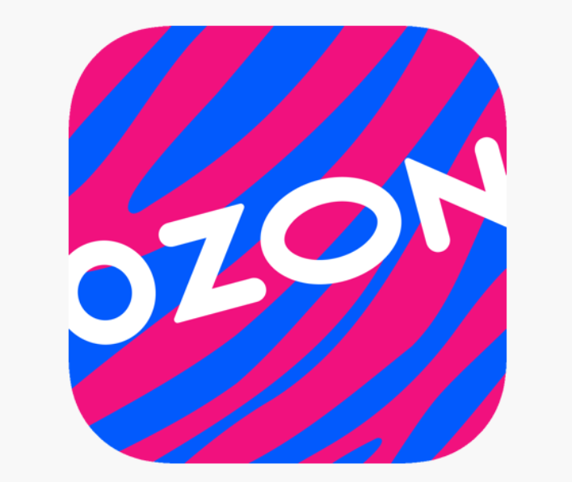
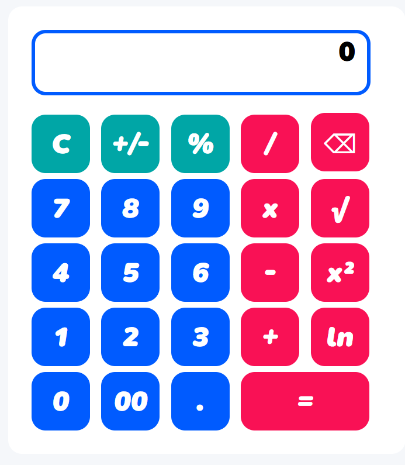
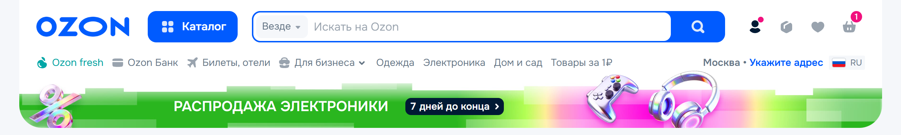
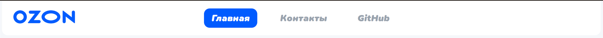
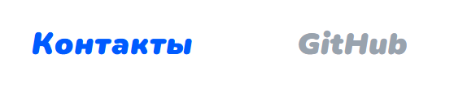
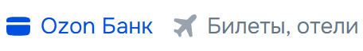
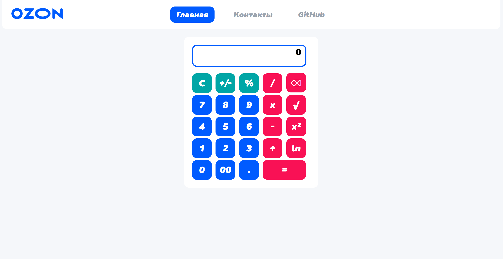
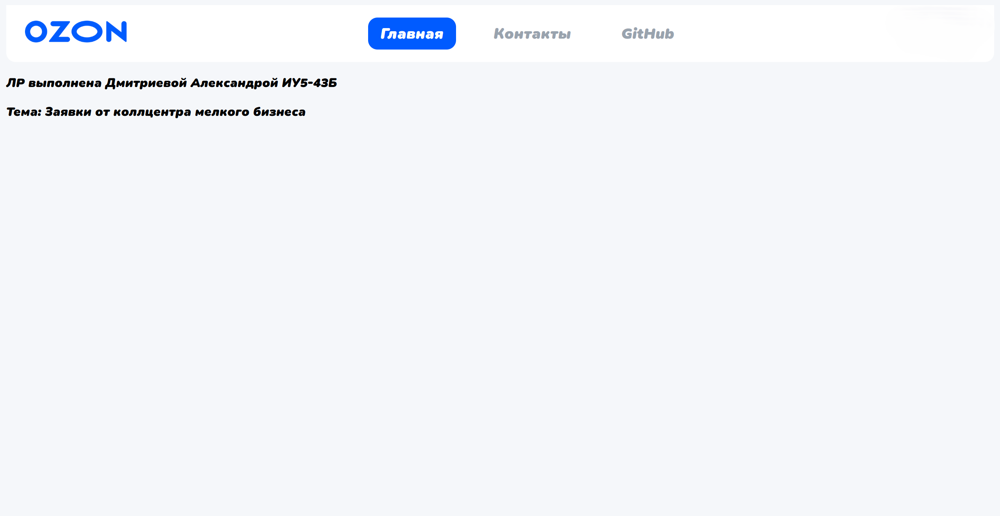

# ЛР 1. Calculator. HTML/CSS

**Цель** данной лабораторной работы - знакомство с инструментами построения пользовательских интерфейсов web-сайтов: HTML, CSS. В ходе выполнения работы, вам предстоит ознакомиться с кодом реализации простого калькулятора,  и затем выполнить задания по варианту.

***Тема:*** Заявки от коллцентра мелкого бизнеса.

## Стиль калькулятора

Основной контейнер калькулятора центрирован по горизонтали на странице с помощью автоматических отступов. Ему задан белый фон, скругленные углы (12px) и фиксированная ширина 300px. Внутренние отступы (padding) обеспечивают пространство между границей контейнера и элементами управления.





```css
.calculator {
  margin-left: auto;
  margin-right: auto;
  margin-top: 20px;
  background:  white;
  border-radius: 12px; /* Выбрано по примеру сайта-образца */
  padding: 20px;
  width: 300px;
}
```

### Стиль кнопок калькулятора

Кнопки имеют квадратную форму (50x50px) со скругленными углами. Базовый цвет кнопок — синий (#005bff), текст белый и жирный. Реализованы эффекты взаимодействия: при наведении курсора фон меняется на темно-серый, при нажатии увеличивается яркость. Для группировки операций используются модификаторы классов.

Стиль кнопок с цифрами от 0-9, 00 и "."

```css
.my-btn {
  margin-right: 5px;
  margin-top: 5px;
  width: 50px;
  height: 50px;
  border-radius: 12px;
  border: none;
  background: #005bff;
  color: white;
  font-size: 1.5rem;
  font-weight: 900;
  cursor: pointer;             /* при наведении на кнопку курсор будет изменен
                                  со стрелки на 'указательный палец' */
  user-select: none;
}

.my-btn:active {
  filter: brightness(150%);
}

.my-btn:hover {
  background: darkgray;
}
```

Стиль кнопок "C", "+/-", "%"

```css
.my-btn.secondary {
  background: #00a6a6;
}
```

Стиль остальных кнопок

```css
.my-btn.primary {
  background: #f91155;
}
```

### Стиль окна с результатом

Поле вывода результатов имеет белый фон и выделено синей рамкой толщиной 3px. Текст внутри выровнен по правому краю для удобства чтения чисел. Используется жирное начертание шрифта и увеличенный размер для лучшей видимости.

```css
.result {
  width: 274px;
  height: 50px;
  margin-bottom: 10px;
  padding-right: 10px;
  background: white;
  border: 3px solid #005bff;
  border-radius: 12px;
  text-align: right;
  color: #000000;
  font-size: 1.5rem;
  font-weight: 900;
  font-family: 'SN Pro', Arial, sans-serif;
}
```

## Стиль заголовка

Шапка сайта реализована через Flexbox-контейнер. Фон белый, нижние углы скруглены для визуального перехода к основному контенту. Внутренние отступы обеспечивают аккуратное расположение логотипа, навигации и переключателя темы.





```css
header {
  display: flex;
  background-color:white;
  align-items: center;
  justify-content: space-between;
  padding: 8px 24px;
  border-bottom-left-radius: 12px;
  border-bottom-right-radius: 12px;
}
```

## Стиль кнопок заголовка





Навигационные ссылки стилизованы под кнопки. По умолчанию текст серый, без подчеркивания. При наведении цвет текста меняется на синий. Активная страница выделяется синим фоном с белым текстом. При наведении на активную ссылку также применяется эффект увеличения яркости.

```css
.nav-link {
  color: rgb(153, 163, 174);
  text-decoration: none;
  font-size: 1.2rem;
  padding: 0.5rem 1rem;
  border-radius: 12px;
  transition: background-color 0.3s;
}

.nav-link:hover {
  color: #005bff;
}

.nav-link.active {
  background-color: #005bff;
  color:white;
}

.nav-link.active:hover {
  filter: brightness(120%);
}
```

## Стиль страницы

Фон всей страницы имеет светло-серый оттенок (rgb(245, 247, 250)). Для всех элементов глобально установлен кастомный шрифт 'SN Pro Italic'.

```css
* {
  font-family: 'SN Pro Italic', Arial, sans-serif;
}

body {
  background-color: rgb(245, 247, 250);
}
```



## Логотип

Изображение логотипа имеет строго заданные размеры в пикселях, чтобы сохранять пропорции и корректно отображаться в шапке сайта рядом с навигацией.

```css
.logo {
    width: 139.68px;
    height: 43.99px;
}
```

## Страница "Контакты"

Оформление страницы контактов выполнено в едином стиле с главной страницей калькулятора. Используются те же классы для шапки, навигации и фона тела страницы.




## Выпоненное дополнительное задание:
Стили кнопок приведены к стилю сайта "основы", изменён цвет, добавлено скругление, подобран шрифт (замена на курсив в качестве задания от преподавателя).

Создана шапка страницы с переходами на страницу с контактами и на репозиторий проекта на GitHub.
Форма и стиль шапки повторяет стиль сайта-примера. На шапку добавлен логотив компании в соответсвие с темой.
