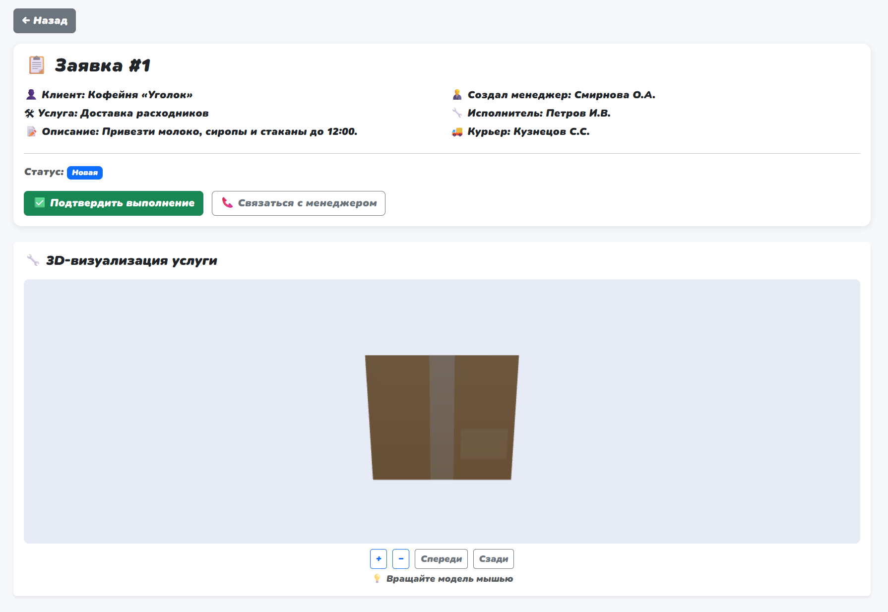
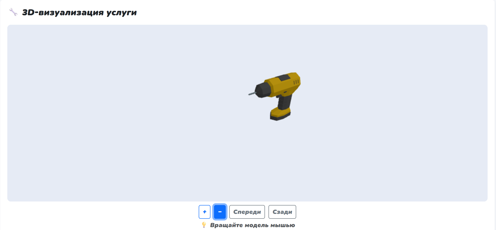

# Домашнее задание. Коллекции, функции и 3D-визуализация

**Цель** — внедрение алгоритмов работы с коллекциями в приложение ЛР №3, а также добавление интерактивной 3D-визуализации услуги на странице просмотра заявки.

***Тема:*** Заявки от коллцентра мелкого бизнеса.

## Оглавление

1. [Структура проекта](#структура-проекта)
2. [Часть 1 — Алгоритмы работы с коллекциями](#часть-1--алгоритмы-работы-с-коллекциями)
   - [Задание 1: findExclusiveRequests (diff)](#задание-1-findexclusiverequests-diff)
   - [Задание 2: flattenServiceCategories (flatten)](#задание-2-flattenservicecategories-flatten)
   - [Демонстрация через консоль](#демонстрация-через-консоль)
3. [Часть 2 — 3D-визуализация услуги (Three.js)](#часть-2--3d-визуализация-услуги-threejs)
   - [Архитектура ServiceModelViewer](#архитектура-servicemodelviewer)
   - [Загрузка модели](#загрузка-модели)
   - [Управление камерой](#управление-камерой)
4. [Демонстрация работы](#демонстрация-работы)
5. [Инструкция по запуску](#инструкция-по-запуску)

---

## Структура проекта

```
lab5-frontend/
├── components/
│   ├── back-button/index.js      # Кнопка "Назад"
│   ├── header/index.js           # Шапка с навигацией
│   ├── product/index.js          # Детальная карточка заявки
│   └── request-card/index.js     # Карточка заявки в списке
├── pages/
│   ├── main/index.js             # Главная страница
│   └── product/index.js          # Страница просмотра заявки + 3D
├── utils/
│   ├── functions.js              # Алгоритмы ДЗ (diff, flatten) + тесты
│   └── threeService.js           # Класс ServiceModelViewer (Three.js)
├── models/                       # GLB-модели для визуализации
│   ├── delivery-box.glb
│   ├── tool-kit.glb
│   └── cash-register.glb
├── index.html
└── main.js
```

---

## Часть 1 — Алгоритмы работы с коллекциями

Функции реализованы в `utils/functions.js` и применяются к данным по теме — заявкам колл-центра. Переменные названы в терминах предметной области: `account`, `account_number`, `client_name`, `service_type`.

### Задание 1: findExclusiveRequests (diff)

**Задача:** найти заявки из общего списка, которых нет в списке уже обработанных — например, клиенты которым нужно отправить подарок за ожидание.

Используется **цикл с постусловием** (`while`) без счётчика — перебор идёт до тех пор, пока не будет просмотрен весь список:

```javascript
export function findExclusiveRequests(allAccounts, processedAccounts) {
    const exclusiveAccounts = [];  // массив — коллекция результатов
    let accountIndex = 0;

    // Внешний цикл — по всем заявкам (цикл с условием, не for)
    while (accountIndex < allAccounts.length) {
        const currentAccount = allAccounts[accountIndex];  // объект
        const accountNumber = currentAccount.account_number || currentAccount.id;  // строка
        let isAlreadyProcessed = false;
        let searchPointer = 0;

        // Внутренний цикл — поиск в обработанных (постусловие: останавливается при нахождении)
        while (searchPointer < processedAccounts.length && !isAlreadyProcessed) {
            const processedAccountNumber = processedAccounts[searchPointer].account_number
                                         || processedAccounts[searchPointer].id;
            if (String(accountNumber) === String(processedAccountNumber)) {
                isAlreadyProcessed = true;  // найден — дальше не идём
            }
            searchPointer++;
        }

        if (!isAlreadyProcessed) {
            exclusiveAccounts.push({
                id: accountNumber,
                client_name: currentAccount.client_name || currentAccount.account,
                service_type: currentAccount.service,
                status: currentAccount.status || 'pending'
            });
        }
        accountIndex++;
    }
    return exclusiveAccounts;
}
```

**Используемые конструкции:**
- **Цикл с постусловием** `while` — не по счётчику, а по условию "пока не нашли совпадение"
- **Строка** — `account_number` сравнивается через `String()` для унификации типов
- **Объект** — каждый элемент `allAccounts` — объект с полями `client_name`, `service`, `status`
- **Массив** — `exclusiveAccounts` собирает результат

### Задание 2: flattenServiceCategories (flatten)

**Задача:** развернуть вложенный список категорий услуг (дерево произвольной глубины) в плоский массив.

Используется **стек** и **цикл с постусловием** `do...while`:

```javascript
export function flattenServiceCategories(nestedServiceTree) {
    const flattenedServices = [];           // результирующий массив
    const processingStack = [...nestedServiceTree];  // стек обработки

    do {
        const currentItem = processingStack.pop();  // берём верхний элемент
        if (Array.isArray(currentItem)) {
            // Если вложенный массив — раскладываем в стек в обратном порядке
            for (let reverseIndex = currentItem.length - 1; reverseIndex >= 0; reverseIndex--) {
                processingStack.push(currentItem[reverseIndex]);
            }
        } else if (currentItem !== undefined && currentItem !== null) {
            flattenedServices.push(
                typeof currentItem === 'string' ? currentItem.trim() : currentItem
            );
        }
    } while (processingStack.length > 0);  // постусловие — пока стек не пуст

    return flattenedServices;
}
```

**Входные данные:**
```javascript
const nested = [
    "Доставка",
    ["Ремонт", ["Диагностика", "Замена деталей",
        ["Гарантийное обслуживание", "Постгарантийный ремонт"]], "Настройка"],
    "Установка",
    ["Обучение персонала", "Консультация"]
];
```

**Результат:** плоский список из 9 строк-услуг.

**Используемые конструкции:**
- **Цикл `do...while`** — выполняется хотя бы один раз, останавливается когда стек пуст
- **Массив** — `processingStack` как стек, `flattenedServices` как результат
- **Строка** — услуги обрезаются через `.trim()`
- **Объект** — проверка типа через `typeof`

### Демонстрация через консоль

Функции автоматически запускаются при загрузке `utils/functions.js` и выводят результаты в консоль браузера (F12 → Console):

```
Запуск тестов функций домашнего задания
============================================================

 ТЕСТ 1: findExclusiveRequests (diff)
Найдено заявок для отправки подарков: 3
   1. Кофейня «Уголок» [ACC-2024-001] — Доставка расходников
   2. Магазин «Цветы» [ACC-2024-003] — Установка кассы
   3. Ателье «Игла» [ACC-2024-005] — Консультация

 ТЕСТ 2: flattenServiceCategories (flatten)
Плоский список услуг: 9
   1. Доставка
   2. Ремонт
   3. Диагностика
   ...
```


---

## Часть 2 — 3D-визуализация услуги (Three.js)

На странице просмотра заявки (`pages/product/index.js`) под деталями заявки отображается интерактивная 3D-модель, соответствующая типу услуги.

### Архитектура ServiceModelViewer

Класс `ServiceModelViewer` из `utils/threeService.js` инкапсулирует всю логику Three.js:

```javascript
export class ServiceModelViewer {
    constructor(canvasElement) {
        this.canvas = canvasElement;
        this.scene = null;
        this.camera = null;
        this.renderer = null;
        this.controls = null;
    }

    init(serviceName) {
        // Сцена
        this.scene = new THREE.Scene();
        this.scene.background = new THREE.Color(0xe6ebf5);

        // Камера — перспективная, угол 60°
        this.camera = new THREE.PerspectiveCamera(60,
            this.canvas.clientWidth / this.canvas.clientHeight, 0.1, 1000);
        this.camera.position.set(0, 2, 5);

        // Рендерер — привязан к canvas-элементу
        this.renderer = new THREE.WebGLRenderer({ canvas: this.canvas, antialias: true });
        this.renderer.setSize(this.canvas.clientWidth, this.canvas.clientHeight, false);

        // OrbitControls — вращение мышью
        this.controls = new OrbitControls(this.camera, this.renderer.domElement);
        this.controls.enableDamping = true;

        // Освещение
        this.scene.add(new THREE.AmbientLight(0xffffff, 0.7));
        const dirLight = new THREE.DirectionalLight(0xffffff, 0.8);
        dirLight.position.set(4, 10, 8);
        this.scene.add(dirLight);

        this.loadModelByService(serviceName);
        this.animate();
    }
}
```

### Загрузка модели

Модель выбирается по названию услуги через маппинг:

```javascript
const SERVICE_MODEL_MAP = {
    "Доставка расходников": "models/delivery-box.glb",
    "Ремонт оборудования":  "models/tool-kit.glb",
    "Установка кассы":      "models/cash-register.glb",
    "default":              "models/service-default.glb"
};
```

Загрузка через `GLTFLoader` с коллбеками (без async/await — в стиле ЛР №5):

```javascript
loadModelByService(serviceName) {
    const modelPath = SERVICE_MODEL_MAP[serviceName] || SERVICE_MODEL_MAP.default;
    const loader = new GLTFLoader();

    loader.load(
        modelPath,
        (gltf) => {
            const model = gltf.scene;
            this.centerAndScaleModel(model);  // центрируем и масштабируем
            this.scene.add(model);
        },
        undefined,
        (error) => {
            console.warn('Не удалось загрузить модель:', error);
            this.showFallback();  // синий куб как заглушка
        }
    );
}
```

Модель автоматически центрируется и масштабируется под сцену:

```javascript
centerAndScaleModel(model) {
    const box = new THREE.Box3().setFromObject(model);
    const center = box.getCenter(new THREE.Vector3());
    const size = box.getSize(new THREE.Vector3());

    model.position.x = -center.x;
    model.position.z = -center.z;
    model.position.y = -box.min.y;  // "поставить на пол"

    const maxDim = Math.max(size.x, size.y, size.z);
    if (maxDim > 0) model.scale.multiplyScalar(2.5 / maxDim);
}
```

### Управление камерой

Пользователь может вращать модель мышью (OrbitControls), а также использовать кнопки:

```javascript
setView(direction) {
    const dist = this.camera.position.distanceTo(this.controls.target);
    switch(direction) {
        case 'front': this.camera.position.set(0, 2, dist);  break;
        case 'back':  this.camera.position.set(0, 2, -dist); break;
        case 'left':  this.camera.position.set(-dist, 2, 0); break;
        case 'right': this.camera.position.set(dist, 2, 0);  break;
    }
    this.controls.update();
}

zoomIn()  { this.camera.position.z -= 0.5; this.controls.update(); }
zoomOut() { this.camera.position.z += 0.5; this.controls.update(); }
```

Three.js подключается через **importmap** — без установки npm-пакетов:

```html
<script type="importmap">
{
    "imports": {
        "three": "https://unpkg.com/three@0.160.0/build/three.module.js",
        "three/examples/jsm/": "https://unpkg.com/three@0.160.0/examples/jsm/"
    }
}
</script>
```

---

## Демонстрация работы

### Страница просмотра заявки с 3D-моделью


### Страница просмотра заявки с 3D-моделью



### Вращение модели мышью и кнопки управления



---

## Инструкция по запуску

```bash
# Открыть через Live Server в VS Code
# Приложение доступно по адресу:
# http://localhost:5500
```
