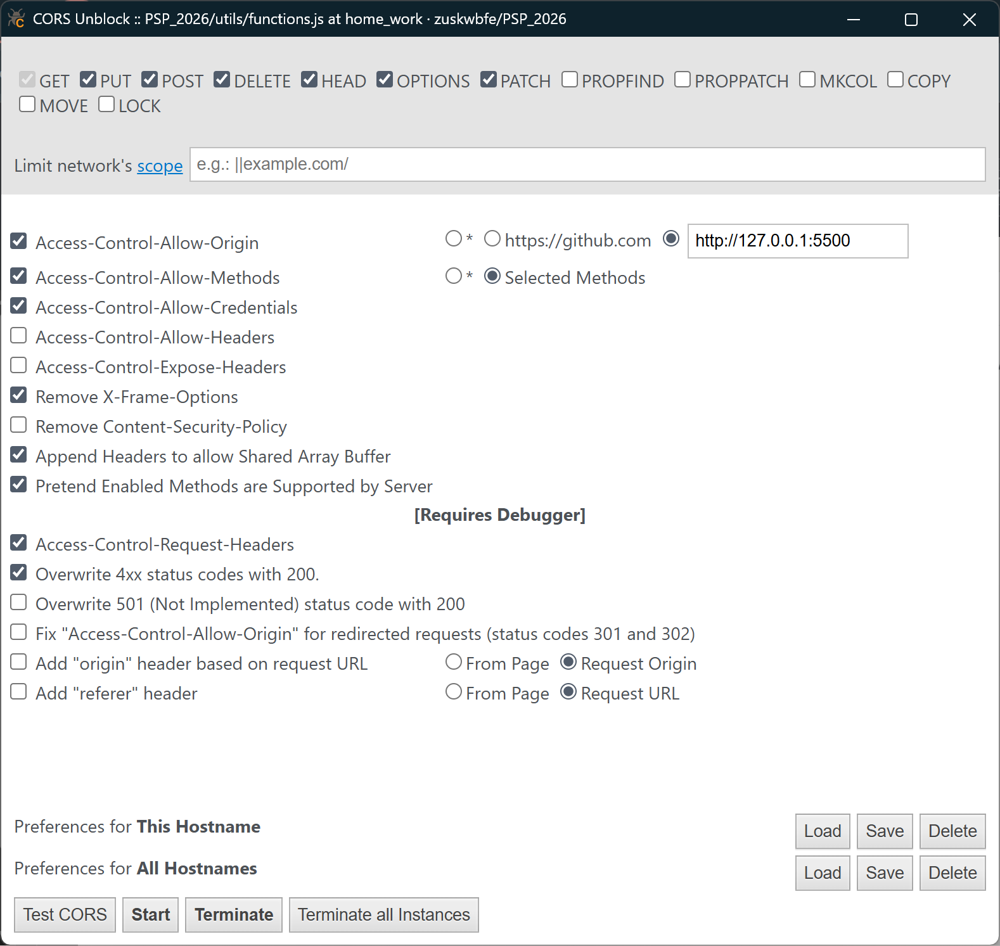
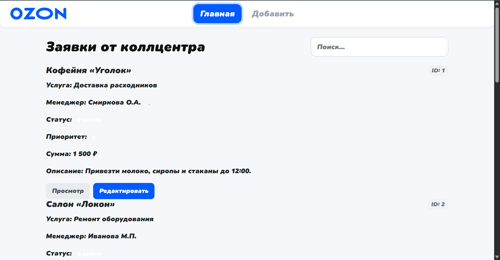
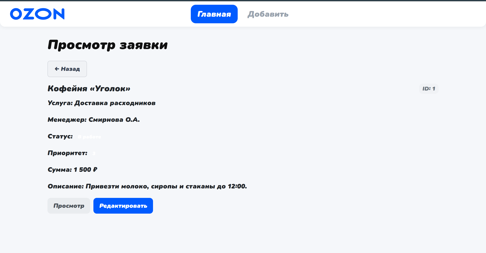
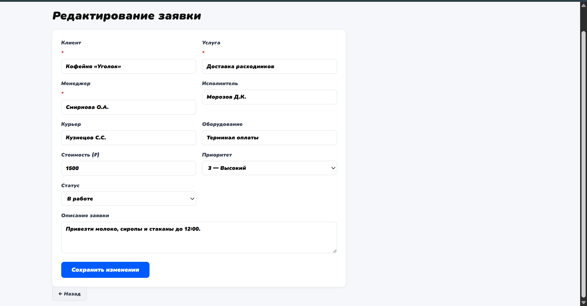

# ЛР 5. Заявки колл-центра. AJAX-запросы через XMLHttpRequest

**Цель** данной лабораторной работы — изучение взаимодействия с внешним API через `XMLHttpRequest`. В ходе работы реализовано получение данных с сервера (ЛР №4) и отображение их в интерфейсе без перезагрузки страницы.

***Тема:*** Заявки от коллцентра мелкого бизнеса.

## Архитектура приложения

Проект построен на компонентном подходе с использованием ES6-модулей. В данной лабораторной добавлен слой `modules` для работы с API:

```
lab5-frontend/
├── components/
│   ├── ProductCardComponent.js   # Компонент карточки заявки
│   └── BackButtonComponent.js    # Компонент кнопки "Назад"
├── modules/
│   ├── ajax.js                   # Класс для XHR-запросов
│   └── stockUrls.js              # URL-адреса эндпоинтов API
├── pages/
│   ├── mainPage.js               # Главная страница со списком заявок
│   ├── cardPage.js               # Страница просмотра заявки
│   └── editPage.js               # Страница редактирования/создания заявки
├── fonts/
│   └── SNPro-BlackItalic.woff2
├── index.html                    # Точка входа, SPA-разметка
└── main.js                       # SPA-роутер на основе hash
```

## Используемые технологии

- **Vanilla JS (ES6 Modules)** — модульная архитектура без фреймворков
- **XMLHttpRequest** — выполнение асинхронных HTTP-запросов к API
- **Bootstrap 5** — стилизация интерфейса
- **Hash-роутинг** — навигация между страницами без перезагрузки (`#`, `#card/1`, `#edit/1`, `#add`)

## Ключевые компоненты

### 1. SPA-роутер — `main.js`

Навигация реализована через `window.location.hash`. При изменении хэша рендерится нужная страница:

```javascript
function renderPage(hash) {
    if (!hash || hash === '#') {
        new MainPage(app).render();
    } else if (hash.startsWith('#card/')) {
        const id = hash.split('/')[1];
        new CardPage(app, id).render();
    } else if (hash.startsWith('#edit/')) {
        const id = hash.split('/')[1];
        new EditPage(app, id).render();
    } else if (hash === '#add') {
        new EditPage(app, null).render();
    }
}

window.addEventListener('hashchange', () => renderPage(window.location.hash));
renderPage(window.location.hash);
```

### 2. Класс Ajax — `modules/ajax.js`

Обёртка над `XMLHttpRequest` с методами для всех HTTP-методов. Каждый метод принимает `callback(data, status)`:

```javascript
class Ajax {
    get(url, callback) {
        const xhr = new XMLHttpRequest();
        xhr.open('GET', url);
        xhr.send();
        xhr.onreadystatechange = () => {
            if (xhr.readyState === 4) {
                this._handleResponse(xhr, callback);
            }
        };
    }

    // Аналогично реализованы post(), patch(), delete()

    _handleResponse(xhr, callback) {
        const data = xhr.responseText ? JSON.parse(xhr.responseText) : null;
        callback(data, xhr.status);
    }
}

export const ajax = new Ajax();
```

Использование:
```javascript
ajax.get(url, (data, status) => {
    console.log(status, data);
});
```

### 3. URL-адреса API — `modules/stockUrls.js`

Все эндпоинты вынесены в отдельный класс, чтобы при смене базового URL менять его в одном месте:

```javascript
class StockUrls {
    constructor() {
        this.baseUrl = 'http://localhost:3000';
    }

    getStocks()           { return `${this.baseUrl}/tickets`; }
    getStockById(id)      { return `${this.baseUrl}/tickets/${id}`; }
    createStock()         { return `${this.baseUrl}/tickets`; }
    removeStockById(id)   { return `${this.baseUrl}/tickets/${id}`; }
    updateStockById(id)   { return `${this.baseUrl}/tickets/${id}`; }
}

export const stockUrls = new StockUrls();
```

### 4. Главная страница — `pages/mainPage.js`

При рендере запрашивает список всех заявок с API и отображает карточки:

```javascript
getData() {
    ajax.get(stockUrls.getStocks(), (data) => {
        this.renderData(data);
    });
}

renderData(items) {
    const container = this.pageRoot.querySelector('#cards-container');
    items.forEach((item) => {
        const card = new ProductCardComponent(container);
        card.render(item, this.clickCard.bind(this));
    });
}
```

### 5. Страница карточки — `pages/cardPage.js`

Запрашивает одну заявку по ID и отображает её:

```javascript
getData() {
    ajax.get(stockUrls.getStockById(this.id), (data) => {
        this.renderData(data);
    });
}
```

### 6. Страница редактирования — `pages/editPage.js`

При открытии в режиме редактирования загружает данные заявки и заполняет форму. Сохранение реализуется в ЛР №6:

```javascript
loadData() {
    ajax.get(stockUrls.getStockById(this.id), (data) => {
        this.fillForm(data);
        this.setupFormListeners();
    });
}
```

### 7. Компонент карточки — `components/ProductCardComponent.js`

Универсальный компонент для отображения заявки. Поддерживает несколько форматов полей (`client`/`clientName`/`companyName` и т.д.) для совместимости:

```javascript
render(data, onClick) {
    const client = data.client || data.clientName || data.companyName || 'Клиент не указан';
    const service = data.service || data.requestType || 'Услуга не указана';
    // ...
}
```

## Проблема CORS и её решение

При запуске фронтенда через Live Server (`http://127.0.0.1:5501`) и обращении к API на (`http://localhost:3000`) браузер блокирует запросы из-за политики CORS:

```
Access to XMLHttpRequest at 'http://localhost:3000/tickets' from origin
'http://127.0.0.1:5501' has been blocked by CORS policy
```

Для решения использовалось расширение **CORS Unblock**. При этом для POST-запросов с `Content-Type: application/json` (сложные запросы с preflight OPTIONS) в настройках расширения дополнительно включались:
- Overwrite 4xx status codes with 200
- Access-Control-Request-Headers



## Демонстрация работы

### Главная страница — список заявок

Данные загружаются через `GET /tickets` и отображаются в виде карточек.




### Страница просмотра заявки

При клике на карточку выполняется `GET /tickets/:id` и отображается детальная информация.



Запрос во вкладке Network:


### Страница редактирования заявки

При переходе на редактирование данные заявки загружаются и заполняют форму.



## Инструкция по запуску

```bash
# 1. Запустить сервер (ЛР №4)
cd PSP_2026
node src/index.js

# 2. Открыть index.html через Live Server в VS Code
# Включить расширение CORS Unblock в браузере

# Приложение доступно по адресу:
# http://127.0.0.1:5501
```

## Сравнение коллбеков и промисов

В данной лабораторной используется подход с **коллбеками** (XMLHttpRequest). В ЛР №6 он заменяется на **промисы** (fetch + async/await):

| | XMLHttpRequest + callback | fetch + async/await |
|---|---|---|
| Синтаксис | Вложенные функции | Линейный, читаемый |
| Обработка ошибок | В каждом коллбеке | Один `try/catch` |
| Вложенность | "Callback hell" | Нет |
| Читаемость | Низкая | Высокая |

```javascript
// ЛР №5 — коллбек
ajax.get(url, (data, status) => {
    if (status === 200) {
        renderData(data);
    }
});

// ЛР №6 — async/await
const data = await api.get(url);
renderData(data);
```
