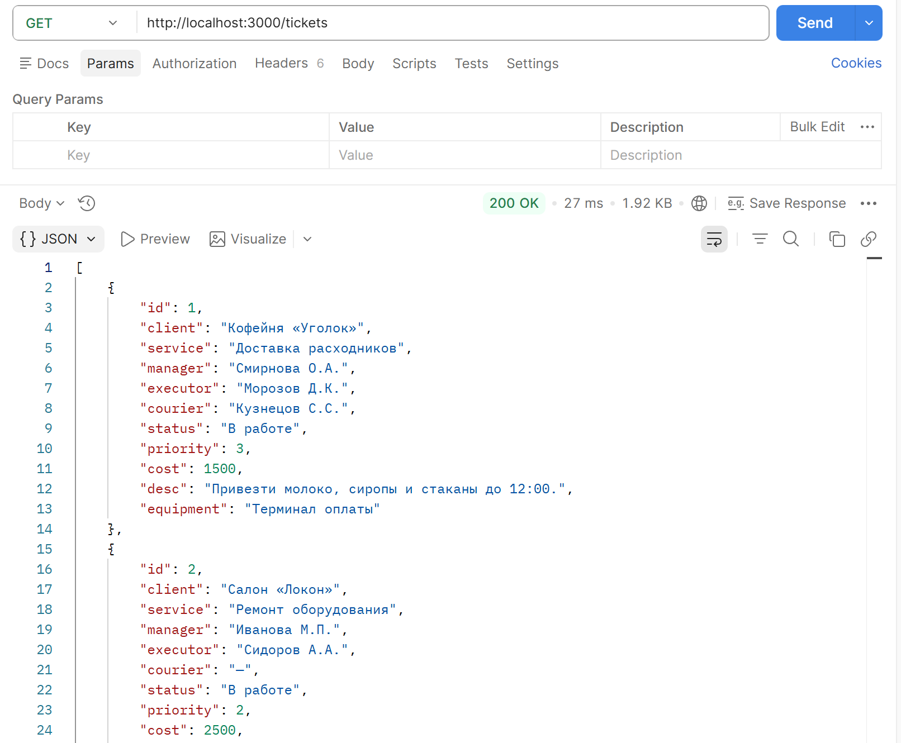
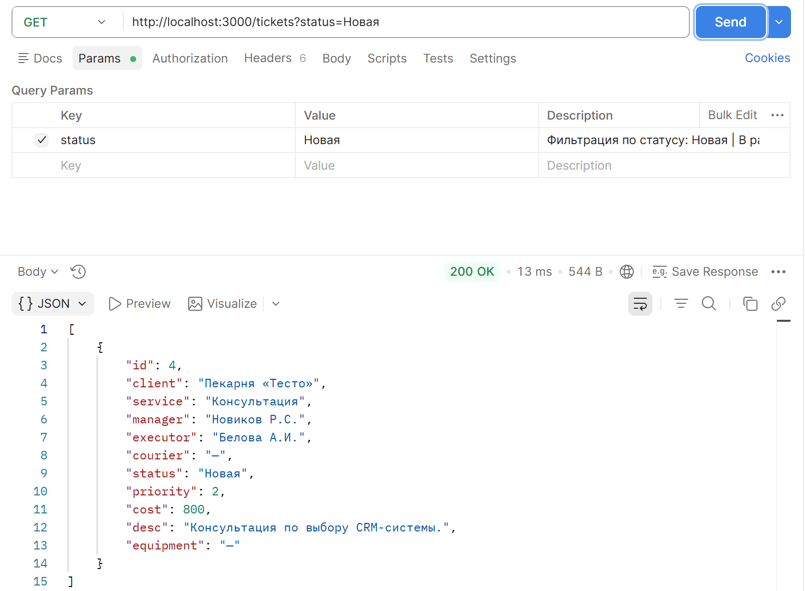
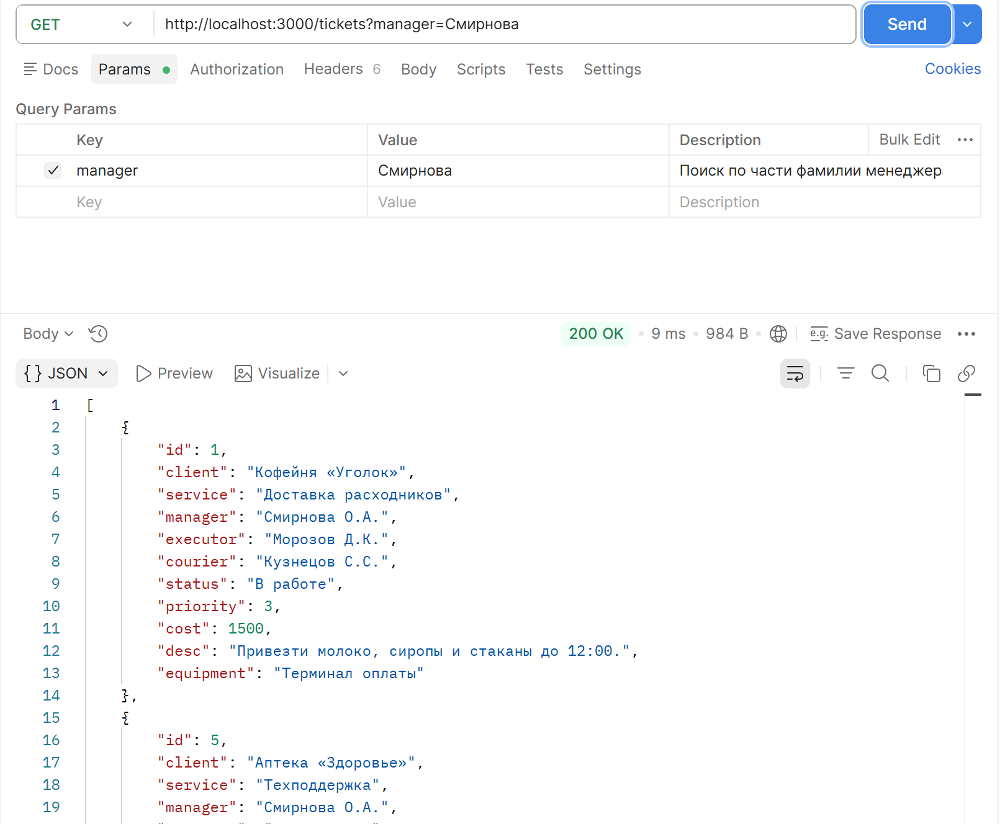
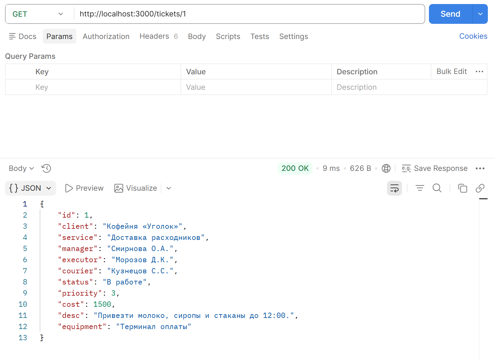
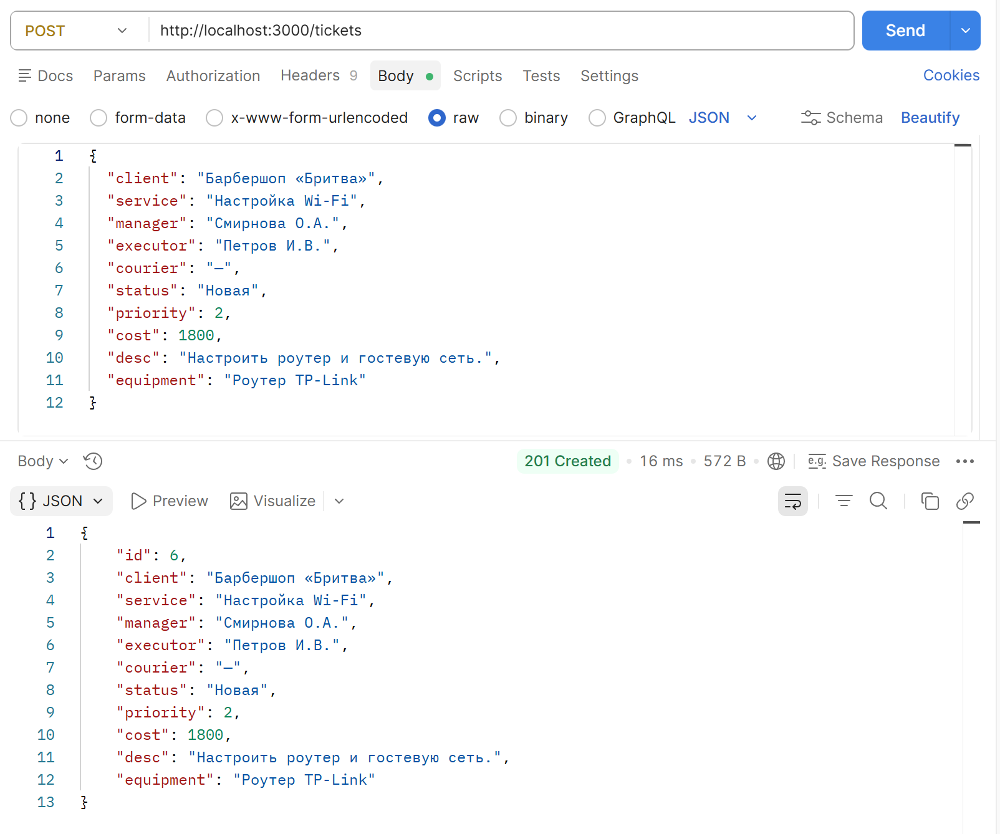
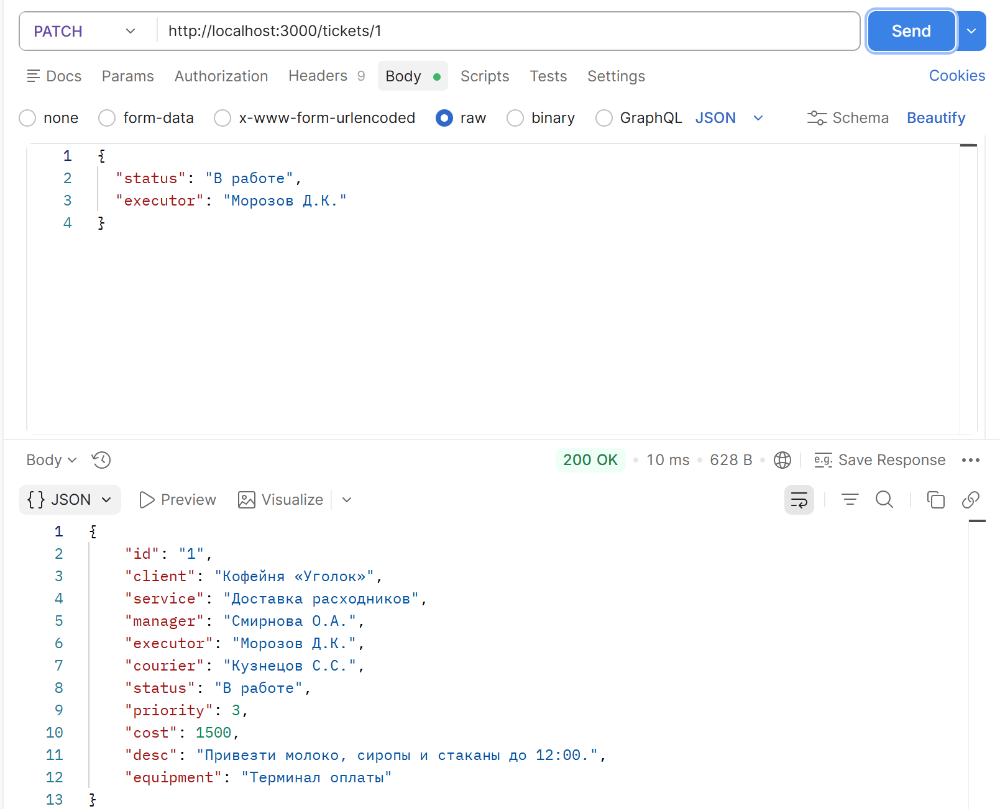
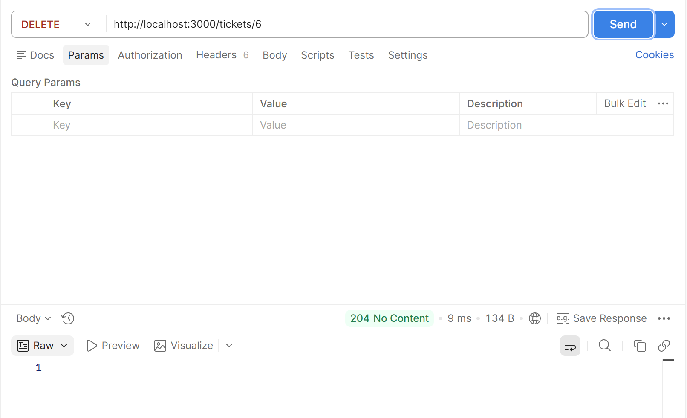
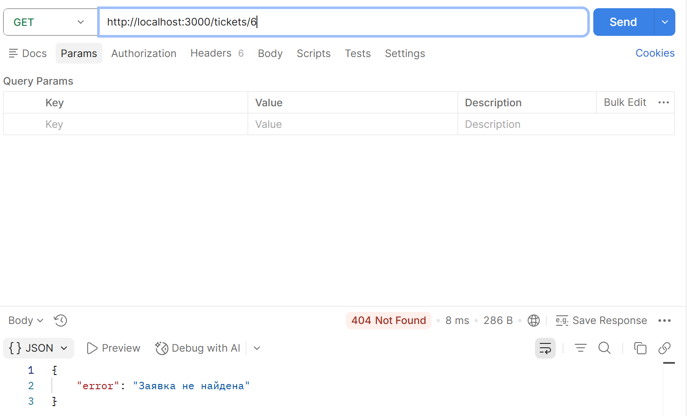
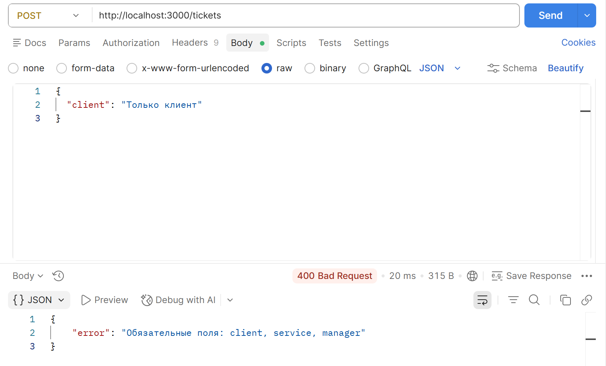

# ЛР 4. Заявки колл-центра. REST API на Express.js

**Цель** данной лабораторной работы — изучение принципов построения серверных приложений на Node.js с использованием фреймворка Express.js. В ходе работы реализован полноценный REST API для управления заявками колл-центра мелкого бизнеса с персистентным хранением данных в JSON-файле.

***Тема:*** Заявки от коллцентра мелкого бизнеса.

## Оглавление

1. [Архитектура приложения](#архитектура-приложения)
2. [Используемые технологии](#используемые-технологии)
3. [Реализованные эндпоинты](#реализованные-эндпоинты)
4. [Ключевые компоненты](#ключевые-компоненты)
   - [Точка входа — src/index.js](#1-точка-входа--srcindexjs)
   - [Сервисный слой — src/services/ticketsService.js](#2-сервисный-слой--srcservicesticketsservicejs)
   - [Контроллер — src/controllers/ticketsController.js](#3-контроллер--srccontrollersticketscontrollerjs)
   - [Файловый сервис — src/services/fileService.js](#4-файловый-сервис--srcservicesfileservicejs)
5. [Структура заявки](#структура-заявки)
6. [Коды ответов API](#коды-ответов-api)
7. [Инструкция по запуску](#инструкция-по-запуску)
8. [Тестирование через Postman](#тестирование-через-postman)

---

## Архитектура приложения

Проект реализован по принципу **Layered Architecture** (Слоистой архитектуры), где каждый слой отвечает за свою область:

```
PSP_2026/
├── src/
│   ├── index.js              # Точка входа — настройка сервера и middleware
│   ├── routes/
│   │   └── tickets.js        # Маршрутизация (Router layer)
│   ├── controllers/
│   │   └── ticketsController.js  # Обработка запросов (Controller layer)
│   ├── services/
│   │   ├── ticketsService.js     # Бизнес-логика (Service layer)
│   │   └── fileService.js        # Работа с файловой системой
│   └── data/
│       └── tickets.json          # Хранилище данных
├── package.json
└── package-lock.json
```

Поток обработки запроса:

**Request → Middleware → Router → Controller → Service → FileService → Response**

## Используемые технологии

- **Node.js** — серверная среда выполнения JavaScript
- **Express.js** — веб-фреймворк для построения REST API
- **JSON-файл** — персистентное хранилище данных (вместо БД)

## Реализованные эндпоинты

| Метод | URL | Описание |
|-------|-----|----------|
| `GET` | `/tickets` | Получить все заявки (с фильтрацией) |
| `GET` | `/tickets/:id` | Получить заявку по ID |
| `POST` | `/tickets` | Создать новую заявку |
| `PATCH` | `/tickets/:id` | Частично обновить заявку |
| `DELETE` | `/tickets/:id` | Удалить заявку |

### Поддерживаемые фильтры для GET /tickets

```
GET /tickets?status=Новая
GET /tickets?manager=Смирнова
GET /tickets?priority=2
```

## Ключевые компоненты

### 1. Точка входа — `src/index.js`

Настройка сервера, подключение middleware и маршрутов:

```javascript
const express = require('express');
const app = express();

// Парсинг JSON-тела запроса
app.use(express.json());

// Логирование запросов
app.use((req, res, next) => {
    console.log(`[${new Date().toISOString()}] ${req.method} ${req.url}`);
    next();
});

// Маршруты
app.use('/tickets', ticketsRouter);

// Глобальный обработчик ошибок (всегда 4 аргумента!)
app.use((err, req, res, next) => {
    console.error(err.stack);
    res.status(500).json({ error: 'Внутренняя ошибка сервера' });
});

app.listen(3000, () => console.log('Сервер запущен: http://localhost:3000'));
```

### 2. Сервисный слой — `src/services/ticketsService.js`

Содержит всю бизнес-логику: фильтрацию, создание, обновление и удаление заявок. Работает через `fileService` для чтения и записи данных:

```javascript
const findAll = ({ status, priority, manager } = {}) => {
    let tickets = fileService.readData(dataFilePath);

    if (status) tickets = tickets.filter(t => t.status === status);
    if (priority) tickets = tickets.filter(t => t.priority === parseInt(priority));
    if (manager) tickets = tickets.filter(t =>
        t.manager.toLowerCase().includes(manager.toLowerCase())
    );

    return tickets;
};
```

### 3. Контроллер — `src/controllers/ticketsController.js`

Отвечает за валидацию входных данных, преобразование типов и формирование HTTP-ответов:

```javascript
const getTicketById = (req, res) => {
    const id = parseInt(req.params.id);  // строка → число

    if (isNaN(id)) {
        return res.status(400).json({ error: 'ID должен быть числом' });
    }

    const ticket = ticketsService.findOne(id);
    if (!ticket) return res.status(404).json({ error: 'Заявка не найдена' });

    res.status(200).json(ticket);
};
```

### 4. Файловый сервис — `src/services/fileService.js`

Абстракция над файловой системой. Синхронное чтение и запись JSON:

```javascript
const readData = (filePath) => {
    const data = fs.readFileSync(filePath, 'utf8');
    return JSON.parse(data);
};

const writeData = (filePath, data) => {
    fs.writeFileSync(filePath, JSON.stringify(data, null, 2), 'utf8');
};
```

## Структура заявки

```json
{
  "id": 1,
  "client": "Кофейня «Уголок»",
  "service": "Доставка расходников",
  "manager": "Смирнова О.А.",
  "executor": "Морозов Д.К.",
  "courier": "Кузнецов С.С.",
  "status": "В работе",
  "priority": 3,
  "cost": 1500,
  "desc": "Привезти молоко, сиропы и стаканы до 12:00.",
  "equipment": "Терминал оплаты"
}
```

## Коды ответов API

| Код | Ситуация |
|-----|----------|
| `200` | Успешный GET или PATCH |
| `201` | Успешный POST (создание) |
| `204` | Успешный DELETE (тело пустое) |
| `400` | Невалидные данные запроса |
| `404` | Заявка или маршрут не найдены |
| `500` | Внутренняя ошибка сервера |

## Инструкция по запуску

```bash
# Установить зависимости
npm install

# Запустить сервер
node src/index.js

# Сервер доступен по адресу:
# http://localhost:3000
```

## Тестирование через Postman

Для тестирования API прилагается коллекция `Tickets_API_postman_collection.json`. Импортируйте её в Postman и выполните запросы:

### GET /tickets — получение всех заявок



### GET /tickets?status=Новая — фильтрация по статусу



### GET /tickets?manager=Смирнова — фильтрация по менеджеру



### GET /tickets/:id — получение заявки по ID



### POST /tickets — создание новой заявки



### PATCH /tickets/:id — частичное обновление заявки



### DELETE /tickets/:id — удаление заявки



Проверяем, что заявка удалена:

### Тест 404 — несуществующая заявка



### Тест 400 — невалидные данные


